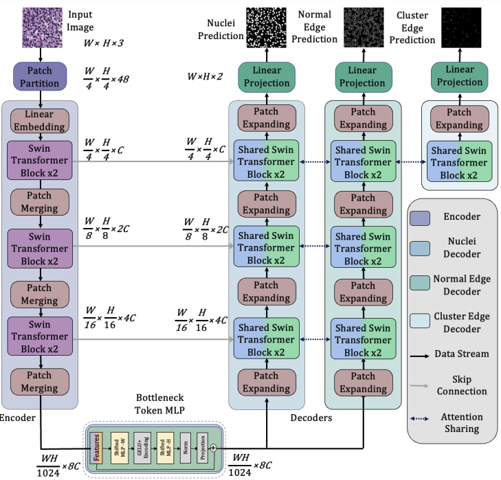

# MICCAI 2023 - TransNuSeg: A Lightweight Multi-Task Transformer for Nuclei Segmentation

## Intro
In this paper, we propose a lightweight multi-task framework for nuclei segmentation. The overall archetecture is demonstrated in the figure below.

<p align="center">
  
</p>

## Dataset
In this paper, we test our model in microscopy and histology datasets.

The Histology dataset can be downloaded [here](https://www.kaggle.com/hjh415/ca25net)

## Quick Start
1, Download the datasets and put the path to the path into HISTOLOGY_DATA_PATH in the 41st line of [train.py](./train.py)

2, Modify the hyperparameters, alpha, beta, gamma and sharing_ratio in [main.sh](./main.sh) or use the default value

3, Run main.sh

```bash
sh main.sh
```

